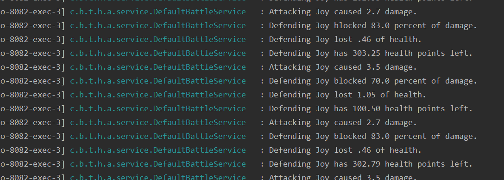

# Java OpenSource

In this project we implemented microservice using different frameworks. We made our first contanct and already learned quite a bit by applying them. The process and difficuleites are discribed below.

## Difficulties and Workarounds

The Frameworks itself were quite the challenge, especially since we are not Java experts and 50% of our team did not work with Java and had some issues with the Java syntax. After some first difficulties the solution ran and worked with simple microservices calling each other.

### Document Entity annotation
As soon as we changed the database and updated our @Document to an @Entity annotation, some issues arose. After some trying and a lot of exceptions, we realised that we had some missing references and reset them. In the end we ended up using @Document. 

### Application settings
Since we were unaware of how to create and run java applications properly we miss used the run configurations instead of the application.properties. All server ports were simply set with the run parameter "-Dserver.port=\[port-number\]". The problem with these configurations are that they are only local. Furthermore, with using the Eureka Framework, these properties became a necesseity. We then realised, how simple it could have been. 

### Version issue Resource vs Entity
During the development of the application some issues arose with the Entitymodel. We tried building the application as described in the documentation, however the "org.springframework.hateoas.EntityModel" did not exist. After some research the "org.springframework.hateoas.Resource" was found which, in theory should have accomplished the same thing - but it did not. 
The code compiled and it apperaed to wortk just fine, however when testing the requests, exceptions were thrown. After a lot of investigation and testing We realized that the main POM had the wrong parent version. It might have been 2.0.1 insted of 2.2.2. After realising this and chaning all resources to entitymodels everything worked fine.

The correct version was set as below:
```XML
    <parent>
        <groupId>org.springframework.boot</groupId>
        <artifactId>spring-boot-starter-parent</artifactId>
        <version>2.2.2.RELEASE</version>
        <relativePath/> <!-- lookup parent from repository -->
    </parent>
```

### Overthinking and forgetting

A smaller issue was, that we implemnted the create party as a post method, since it made more sense during that time. This might not appear as a big issue. However, when a GET request is sent to a controller with a method configured as a post the 405-error confused us. After a few investigations the error was found rather quickly, however the 405 first led us to the wrong path.

### Fallback not working

The fallbacks were implemented as described, however they unfortunately did not work. When the service was not started and a request was sent, the Eureka client simply informed us, that the requestes service was not available. We investigated and tried different things, like adding a @EnableCircuitBreaker. This was recommended in some stack overflow posts but it did not solve the issue. 
Unfortunately, none of the attempted fixes worked and the fallback, is added however not working. 

### Annotation not working

In some extension we have added a tried inject clients via the @Autowired attribute. In some cases, this did not work at all. We've researched for a bit and found that referecning the correct packages where the injected clients are, should help 
```JAVA
@SpringBootApplication(scanBasePackages={"ch.bfh.theforkers.heroes.healer.client"})
```
This did infact help compiling the application, however the controllers were not available. Neither in the eureka client or directly. 
Therefore, some classes were combined making the injection unecessary.
Additionally some request were then sent as a simple http request rather than a nice feignclient. This was a pitty and a lot of hours were invested. However we did not get it working.

```Java
 //defender = healerClient.heal(defender); 
 //^^ this would have been beautiful, but did somehow not work
HttpHeaders headers = new HttpHeaders();
headers.setContentType(MediaType.APPLICATION_JSON);
HttpEntity entity = new HttpEntity(defender,headers);
ResponseEntity<Hero> out = new RestTemplate().exchange("http://localhost:8083/healer/heal", HttpMethod.POST, entity
        , Hero.class);
Hero hero = out.getBody();
defender = hero;
```

### Ordering when starting the application

When starting the applications in a random order some were not available in the Eureka Registry. Therefore, a compound was created with all the services and the registry was started seperatly in the beginning. This helped, nontheless, in some cases some services needed to be restarted to work. 

## Extensions

As a frist extension a "Healer" was added. In its first version it was very simple and only worked with a simple double value. The idea was that a fighter could go heal himself during fights. So, the fighter sent in his HP as a double and recieved an increased HP back. The fighter was sent to the healer with a 30% chance. This was accomplished as shown below:

```Java
 if(Math.random() > 0.7){
     
 }
```
This worked, however in some cases lead to a http 500 error due to a server timeout. When analysing the logs we realised why: 


Therefore we then implemented a limit within the healer service. When a hero was healed above 100hp, 100 was returned insted of his new health. This already helped. However, we then reduced the chance to heal to 10% which helped even further. 

This implementation did not feel complete, since it was very basic and not very interesting. Therefore, we tried to implement some sort of payment system. Which meant each hero needed to have coins or gold. 
Since each service had his own Model which represented the party and the hero, we decided to move all models into an "entity" module which all services referenced. This simplified any changes that might arise in the future. Obviously, each service would need to reference an additonaly module. This might arguably be a backdraw. However we still would consider it an overall improvment.

Then the "Hero" was granted gold 
```Java

    public double getGold () {
        return hp;
    }
    public void setGold (double gold) {
        this.gold = gold;
    }
```

The Idea then was to create a Potionshop which held potions. Each potion has a price, a name and "healingamount", which show the amount of hp that the potion would heal. As potions we used the Dungeon and Dragons potions. Since they already had values, healing amounts and names. 

```Java
potions.add(potionService.createPotion("commmon healing potion", 50, 6.5));
potions.add(potionService.createPotion("greater healing potion", 200, 12.5));
potions.add(potionService.createPotion("superior healing potion", 1000, 25.0));
```

This was all implemtned in a "Potionshop" module which held a Potionservice and a potionshop service. These were implemented similarly to the Hero and Party service. Additonaly a "HealingPotion" and a "PotionShop" entity was added to the entity module. 

The plan was, that the healer would get a Hero from the BattleService, this hero would forfeit all his gold, which he recieved randomly. The Healer would then go to the potionshop and buy all the potions he can and give them to the Hero immediatly. 
This unfortunately did not work. We have not figgured out why, but the healer simply does not want to go to the potionshop. It compiles and looks great (at least to the untrained eye). However, when ran, the healer throws exceptions instead of healing spells. 

Therefore, the Potionshop was then abandoned from the town and the healer started his own shop. 

## Final Result

The Heros are battling for their life in the arena, and if the gods allow it, they can go to the healer and give him all their money. The healer, Gandalf, then looks in his shop, which he filled and priced himself, and gives the hero, all his money can buy, and heals him. The Hero goes back into battle. During the battle this might happen several times, however Gandlaf does not work for free. 

To achvieve this, the following thins were aadded: 
- Entity Module
  - Healing Potion
  - Potion Shop
- Healer Module
  - Heler Controller
  - Healer Service
  - Gandalf Service
  - (Potionshopclient)
  - (Fallbackpotionshopclient)
- Broken Potionshop
  - Potion Repo
  - PotionService
  - ShopService
  - PotionshopController

Unfortunately the potionshop does not do much. The module is still in the git repositroy, simply as a sad memory of unfulfilled adventures.

## How to Run

To run the application, the registry service needs to be started first then all the others can be started. 
```XML
<Spring Boot: ArenaApplication,null>
<Spring Boot: CampApplication,null>
<Spring Boot: FrontendApplication,null>
<Spring Boot: HealerApplication,null>
<Spring Boot: PromoterApplication,null>
```
The Potionshop unfortunately has no real function at the moment therefore it does not need to be started.

Then the promoter service is avaialbable via the url :
http://localhost:8081/promoter/promoteFight

We realised that it occurs, that some services are not available. When this happens the corresponding application needs to be restarted. 

## Conclusion

The course was very interesting and gave a good oversight of modern Java development. Unfortunately, we both were very involved in our thesis and did not follow the course as intended. Therefore, a lot had to be learned with pain and suffering. 

